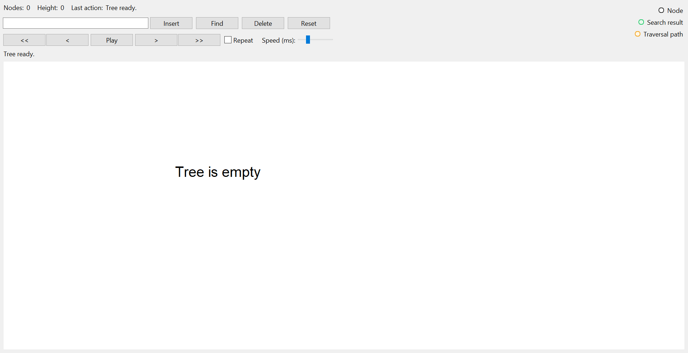
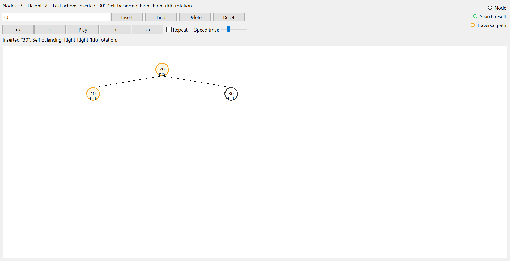
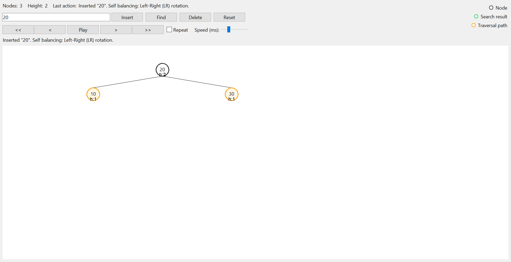
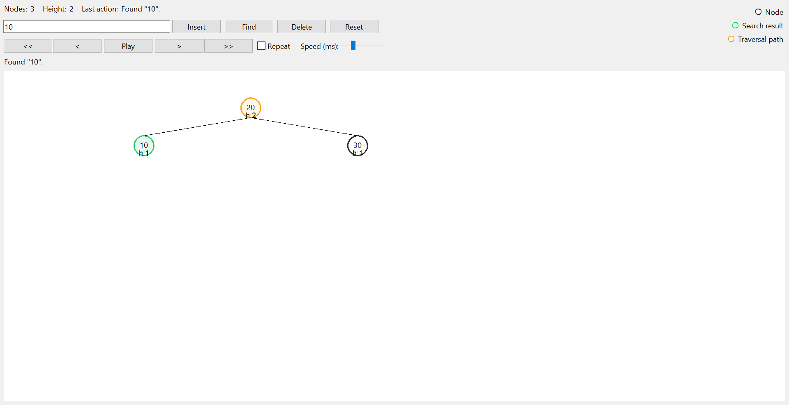
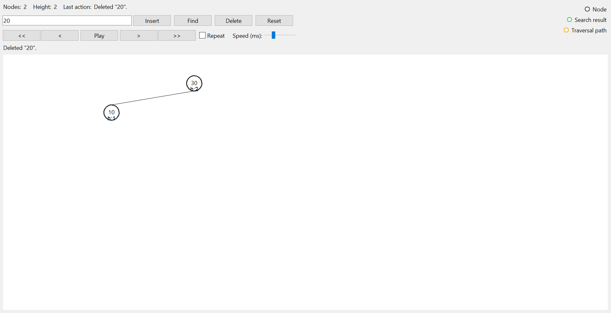

# AVL Tree Visualizer (Tkinter)

An interactive, visual simulator for AVL (Adelson-Velsky and Landis) Trees built in Python using the `tkinter` GUI framework. This tool visualizes AVL insertions, deletions, searches, and real-time self-balancing rotations (LL, RR, LR, RL) frame-by-frame with animation playback controls.

### 📚 What is an AVL Tree?
An **AVL Tree** is a self-balancing Binary Search Tree (BST) where the heights of the two child subtrees of any node differ by at most one ($|BF| \le 1$). If an insertion or deletion causes the height difference to exceed this balance threshold, the tree self-balances via structural rotations. 

Because it maintains strict balance:
- **Search, Insertion, and Deletion** operations all have a guaranteed worst-case time complexity of $\mathcal{O}(\log n)$.
- It is faster than Red-Black trees for search-intensive workloads due to its stricter balance constraint.

### ⚙️ Real-World Applications
- **Database Indexing**: Used in database storage engines where lookup operations are extremely frequent and latency must be guaranteed.
- **Virtual Memory Allocation**: Employed in operating system kernels to manage memory pages and search for free space blocks quickly.
- **Fast Lookup Dictionaries**: Used in high-performance lookup tables and symbol tables inside language compilers.
- **IP Routing Tables**: Used in network routers to match incoming packet IP addresses with destination routes under tight deadlines.

---

## 📸 Interactive UI Gallery

Here is a visual overview of the application in action:

| Screen | Description | Screenshot |
| :--- | :--- | :--- |
| **01. Initial State** | The empty visualizer window, showing stats, controller inputs, and legend overlay. |  |
| **02. RR Rotation** | The tree balance restored via a Right-Right (RR) rotation (single Left rotation) after inserting `10 -> 20 -> 30`. |  |
| **03. LR Rotation** | A Left-Right (LR) double rotation triggered by inserting `30 -> 10 -> 20`, balancing the tree with `20` as the root. |  |
| **04. Traversal Highlight** | Visualizing a search action for value `10`. Traversal paths are highlighted in orange, and the found target is shown in green. |  |
| **05. Deletion & Rebalance** | The tree state after deleting root `20` from the tree, replacing it with its inorder successor, and self-balancing. |  |

---

## ✨ Key Features

- 🔄 **Auto-Balancing Visualizations**: Dynamic display of single and double rotations (`LL`, `RR`, `LR`, `RL`) with real-time descriptive statuses.
- 🎞️ **Animation Timeline & Playback**:
  - Auto-plays step-by-step traversal and rotation animations.
  - Controls include `<<` (Go to Start), `<` (Step Back), `Play/Pause`, `>` (Step Forward), and `>>` (Go to End).
  - Configurable loop (`Repeat` checkbox) and adjustable animation speed slider (150ms to 2000ms).
- 🎨 **Clear Legend & UI Markers**:
  - **Traversal Path** (Orange border/fill): Highlights the nodes currently being checked during search, insertion, or deletion.
  - **Target Found** (Green border/fill): Identifies the matching node during search operations.
  - **Node Heights**: Automatically displays each node's current height (`h:X`) below its value.
- 🧮 **Duplicate Handling**: Allows duplicate key insertions with a custom split rebalancing scheme.
- 🔌 **Zero External Runtime Dependencies**: Built entirely using the standard Python library (`tkinter`).

---

## 🚀 Getting Started

### Prerequisites
- **Python 3.x**
- Standard `tkinter` package (usually bundled with Python installations, but installable via `sudo apt-get install python3-tk` on Linux).

### Installation & Run

1. **Clone or navigate** to the repository root:
   ```bash
   git clone https://github.com/NAMPALLY-PRANAY/Avl_tree_vis.git
   cd Avl_tree_vis
   ```

2. **Run the Application**:
   You can launch the main program directly:
   ```bash
   python python_tk_avl/main.py
   ```
   Or run it as a module:
   ```bash
   python -m python_tk_avl.main
   ```

---

## 🛠️ Code Architecture

The codebase is split into three clean files following a model-view controller (MVC) style design:

```
python_tk_avl/
│
├── avl.py                 # Core AVL Tree Algorithm and state snapshots (Model)
├── main.py                # Tkinter GUI framework and timeline render engine (View/Controller)
└── images/                # Saved app snapshots displayed in the README.md
```

### 1. The AVL Engine (`avl.py`)
This file implements the binary tree nodes and AVL-specific balancing rules:
- **`Node`**: Houses properties like `value`, `left`, `right`, and `height`.
- **`AvlTree`**:
  - Maintains `root` and configures `duplicate_side` insertion strategy.
  - **`insert(value)`**: Inserts values recursively, computes balance factors, and triggers rotations. If a duplicate is inserted, it collects the tree nodes in-order and triggers a median-split rebalance to optimize tree depth.
  - **`delete(value)`**: Performs standard BST deletion, substituting deleted nodes with their inorder successor (`_min_value_node` of the right subtree), followed by AVL height repairs.
  - **`find(value)`**: Traces the search path iteratively, recording visited nodes for highlighting on the GUI timeline.
  - **`snapshot()`**: Captures the state of the tree structure as a nested dictionary, which is passed to the GUI timeline for rendering.

### 2. The Tkinter GUI Visualizer (`main.py`)
This file manages the window layout and renders the AVL tree:
- **`AVLApp`**:
  - Renders top stats (Node Count, Height, Last Action message).
  - Controls inputs via `ttk.Entry` and action buttons.
  - Orchestrates playback states (using standard `after()` callbacks for asynchronous animation ticks).
  - Draws the tree inside `tk.Canvas` dynamically.
- **Dynamic Layout Algorithm (`assign_positions`)**:
  - Recursively splits the available canvas horizontal space (`x_min` to `x_max`) based on node depth.
  - Computes coordinates `(x, y)` for every node, and binds them to lines (edges) drawn beneath circles representing nodes.
- **Timeline State Management**:
  - Operations return a series of "frames" representing the intermediate states (e.g. visiting node A, then node B, then completing insertion/rotation).
  - Allows stepping backward and forward or playing/pausing the animation transitions.

---

## 🧮 Understanding AVL Rotations

AVL Trees maintain a **Balance Factor** ($BF$) for every node, defined as:
$$BF = \text{Height}(\text{Left Subtree}) - \text{Height}(\text{Right Subtree})$$

An AVL tree is balanced if $-1 \le BF \le 1$. If $|BF| > 1$, self-balancing rotations are executed:

### 1. Left-Left (LL) Rotation
*Triggered when a node is inserted into the left subtree of the left child, causing $BF > 1$ and $BF(\text{left child}) \ge 0$.*
Performed via a single **Right Rotation**:
```
       Parent (A)                Child (B)
         /   \                    /     \
     Child (B) t3    ===>       Left (C) Parent (A)
       /   \                      /       /   \
   Left (C) t2                   t1      t2   t3
     /
    t1
```

### 2. Right-Right (RR) Rotation
*Triggered when a node is inserted into the right subtree of the right child, causing $BF < -1$ and $BF(\text{right child}) \le 0$.*
Performed via a single **Left Rotation**:
```
     Parent (A)                  Child (B)
       /   \                      /     \
      t1  Child (B)  ===>   Parent (A) Right (C)
            /   \             /   \      /
           t2  Right (C)     t1   t2    t3
                  \
                  t3
```

### 3. Left-Right (LR) Rotation
*Triggered when a node is inserted into the right subtree of the left child, causing $BF > 1$ and $BF(\text{left child}) < 0$.*
Performed via a double rotation: **Left Rotation on Left Child**, followed by **Right Rotation on Parent**:
```
      Parent (A)             Parent (A)             Grandchild (C)
        /   \                  /   \                  /        \
    Child (B) t4  ===>    Grandchild (C) t4 ===>  Child (B)  Parent (A)
      /   \                 /   \                  /   \       /   \
     t1 Grandchild (C)  Child (B) t3              t1   t2     t3   t4
           /   \          /   \
          t2   t3        t1   t2
```

### 4. Right-Left (RL) Rotation
*Triggered when a node is inserted into the left subtree of the right child, causing $BF < -1$ and $BF(\text{right child}) > 0$.*
Performed via a double rotation: **Right Rotation on Right Child**, followed by **Left Rotation on Parent**:
```
     Parent (A)               Parent (A)               Grandchild (C)
       /   \                    /   \                    /        \
      t1 Child (B)   ===>      t1 Grandchild (C) ===> Parent (A) Child (B)
           /   \                     /   \             /   \       /   \
    Grandchild (C) t4               t2  Child (B)     t1   t2     t3   t4
         /   \                            /   \
        t2   t3                          t3   t4
```

---

## 🕹️ Controls Reference

- **Insert**: Enter an integer value in the input bar and click **Insert** (or press enter) to insert it into the AVL Tree.
- **Find**: Check if a value exists. Traversal paths will flash step-by-step.
- **Delete**: Remove a value. The tree will locate the key, swap it with its inorder successor if it has two children, and then execute self-balancing rotations on unbalanced ancestors.
- **Reset**: Wipes the tree, letting you start building a new visualization from scratch.
